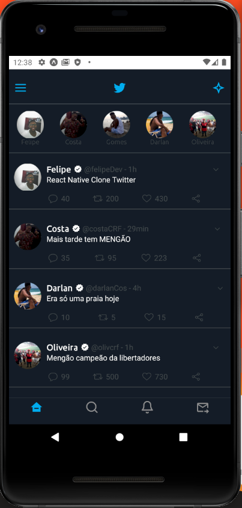

<h2 align="center">Clone Twitter 📲</h2>

<h3 align="center">Portifólio 🚀</h3>

Neste projeto clonamos a interface mobile da rede social "Twitter" em modo 'meio escuro', como descrito pelo próprio aplicativo. No primeiro momento o desenvolvimento foi só da parte principal da rede social. 

Na parte inicial, criamos a parte de "story". O mesmo tem o comportamento de scrollview horizontal como o próprio aplicativo.

A parte central do aplicativo é a área de postagens de usuários. A clonagem do app buscou manter ao máximo as caracteristicas do aplicativo original.

E no final do aplicativo nós utilizamos as navegações bottomTab como o aplicativo incial usa.

<h2 align="center"> Tecnologias 💻</h2>

 

⚒️ Expo

⚒️ React Native

⚒️R eact Navigation

⚒️ Styled-Components

<h3 align="center">Desenvolvido por Felipe Costa</h3>